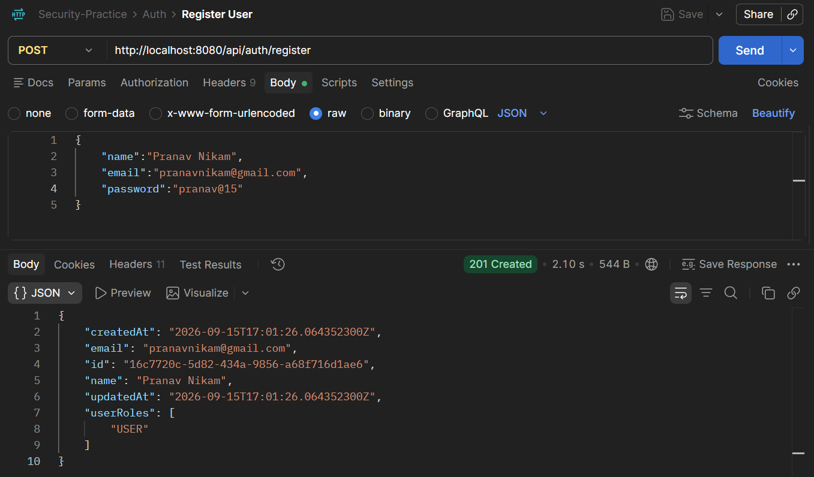
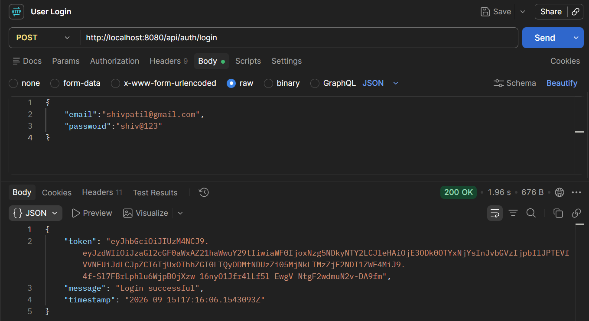
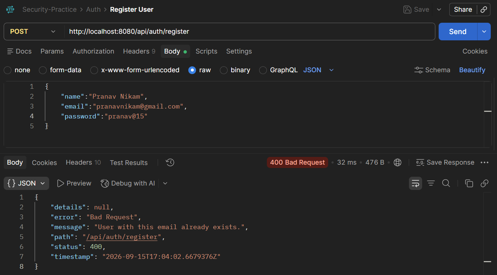
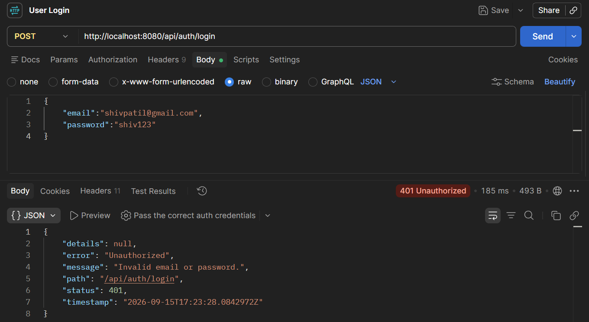
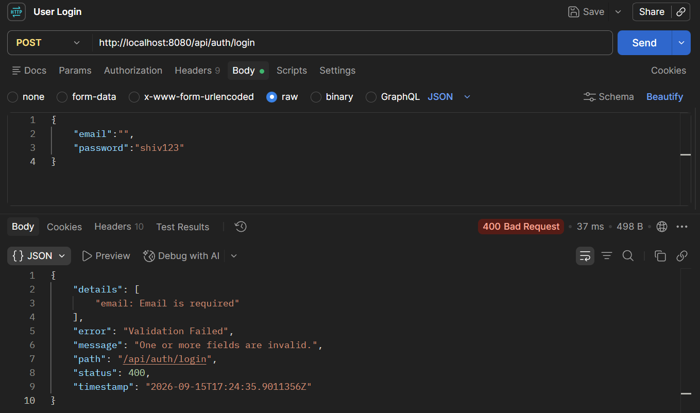
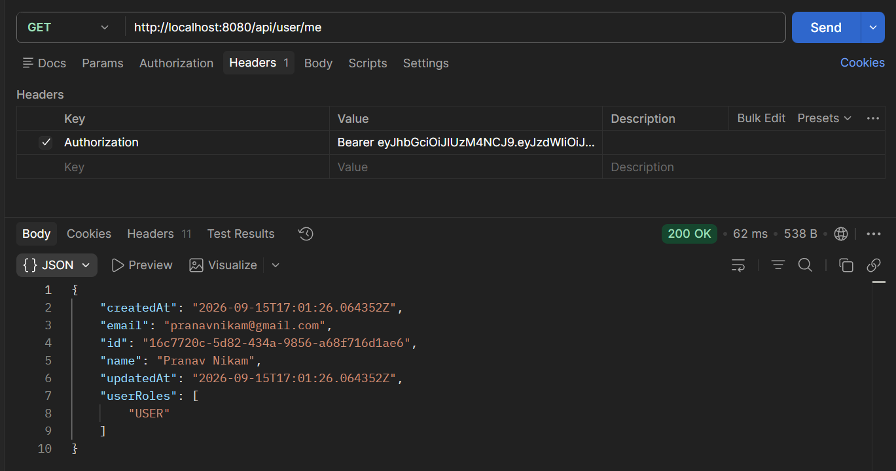
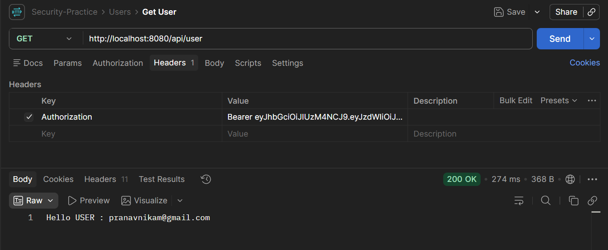
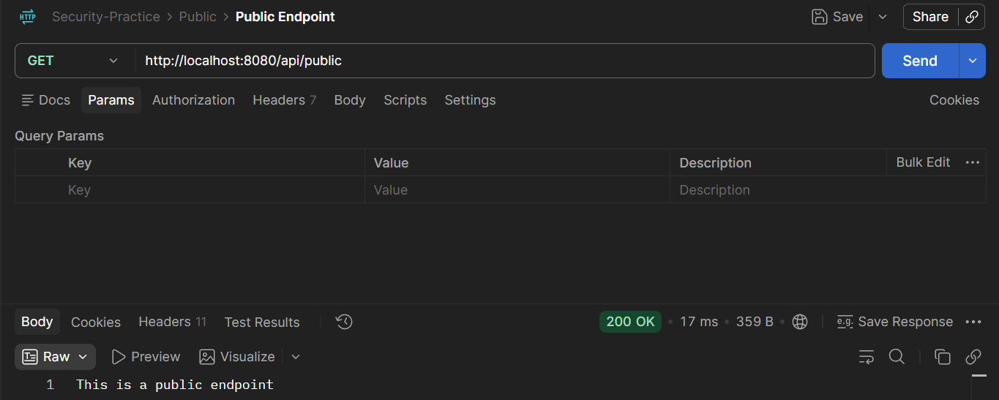
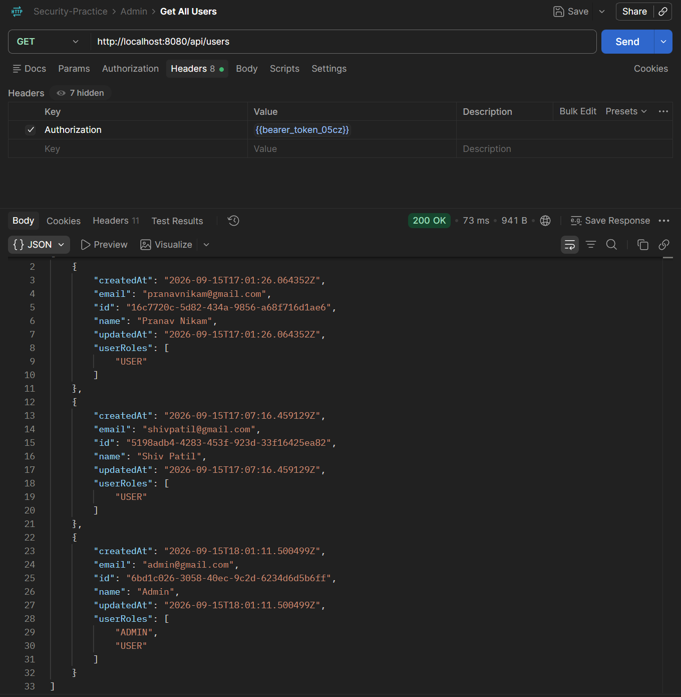

# Spring Security JWT Practice

A hands-on learning project implementing token-based authentication and role-based
authorization in a Spring Boot REST API, using Spring Security and JWT.

Built as a practice project to understand how `Authentication`, `UserDetails`,
JWT filters, and method/URL-level role restrictions fit together in a real
Spring Security setup.

---

## Tech Stack

- **Java 17+**
- **Spring Boot 3.x**
- **Spring Security** — stateless, JWT-based authentication
- **Spring Data JPA** — persistence
- **JJWT (`io.jsonwebtoken`)** — JWT generation & parsing
- **Lombok** — boilerplate reduction (`@Getter`, `@Setter`, `@RequiredArgsConstructor`)

---

## Features

- **User registration & login** with BCrypt password hashing
- **JWT issuance on login**, validated on every subsequent request via a custom
  `OncePerRequestFilter`
- **Role-based access control** — `USER` and `ADMIN` roles gate different endpoints
- **Centralized error handling** (`@RestControllerAdvice`) returning a consistent
  JSON error shape for validation failures, bad input, missing resources, and
  authentication failures
- **Stateless sessions** — no server-side session state; the JWT carries identity
  and roles on every request

---

## Project Structure

```
src/main/java/practice/auth/
|
├── config/          # SecurityConfig - filter chain, role rules, beans
├── controller/      # REST endpoints (AuthController, UserController)
├── dtos/            # Request/response payloads
├── entity/          # JPA entities (User, Role)
├── exceptions/      # Custom exceptions + GlobalExceptionHandler
├── repository/      # Spring Data JPA repositories
├── security/        # JwtAuthenticationFilter, CustomUserDetailsService
├── service/         # Business logic (AuthService, UserService)
└── util/            # JwtUtil - token generation/parsing
```

---

## API Endpoints

| Method | Endpoint | Auth required | Description |
|--------|----------|---------------|--------------|
| `POST` | `/api/auth/register` | None | Register a new user (always created with `ROLE_USER`) |
| `POST` | `/api/auth/login` | None | Log in, returns a JWT |
| `GET` | `/api/public` | None | Sample public endpoint |
| `GET` | `/api/user` | `ROLE_USER` | Sample endpoint restricted to regular users |
| `GET` | `/api/admin` | `ROLE_ADMIN` | Sample endpoint restricted to admins |
| `GET` | `/api/user/me` | Any authenticated user | Returns the logged-in user's own profile |
| `GET` | `/api/users` | `ROLE_ADMIN` | List every registered user |
| `GET` | `/api/users/{id}` | Any authenticated user | Fetch a single user by id |
| `DELETE` | `/api/users/{id}` | `ROLE_ADMIN` | Delete a user by id |

## Screenshots

## Screenshots

<p>
  
  
</p>

<p>
  
  
</p>

<p>
  
  
</p>

<p>
  
  
</p>

<p>
  
</p>

---

- This project is for personal learning purposes. Feel free to fork or reference it.